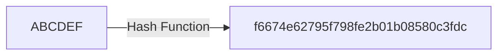
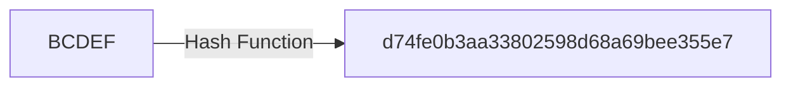

## What is a cryptographic hash function?

#### tl;dr

Cryptographic hash functions take an input or any size and convert it into a string of fixed size.



### Detailed explanation

##### Hash functions characteristics
 
1. It is practically impossible to re-generate an original message out of its hash
2. The tiniest change in the original message, changes the hash beyond recognition.

For example hashes generated from ```ABCDEF``` and ```BCDEF``` are totally different:


in Ethereum, Keccak-256 and  Keccak-512 are mostly used.

3. it is practically impossible to find two different messages with the same hash

#### What are hash functions used for?

- Indexing and searching through data (through the use of Merkle trees)
- Verifying data integrity (thanks to the "same data, same hash" rule)
- 

Using hash functions in combination with [cryptographic keys](public-private-key.md) anyone can prove that they own a piece of data without disclosing the data itself.
Indirectly, it proves:
That the owner of the data knows their password.
