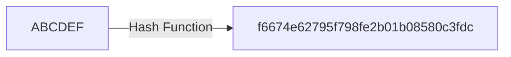

##  What is a hash function?

####  tl;dr
Cryptographic hash function take an input and convert it into an output. 

###  Detailed explanation
Ethereum addresses are generated using a contract's [public key](/docs/Ethereum-glossary-for-newbies/public-private-key.md), they represent the location of an Ethereum contract.