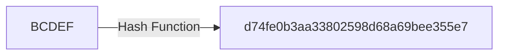
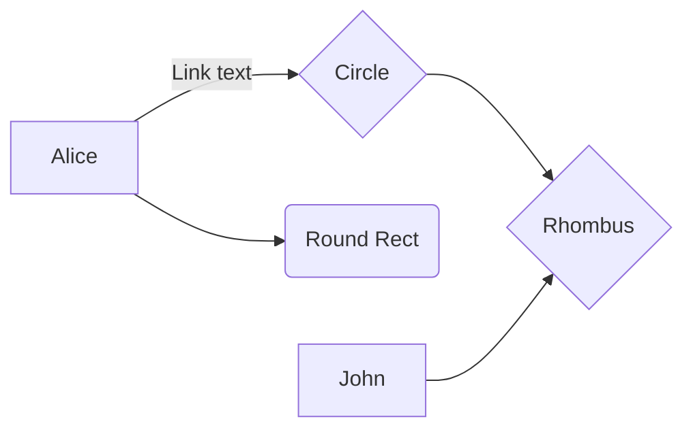

##  What is a cryptographic hash function?

####  tl;dr
Cryptographic hash function take an input and convert it into a cyphered output.


###  Detailed explanation

#####  Hash functions characteristics
 
1. It is practically impossible to re-generate an original message out of its hash
2. The tiniest change in the original message, changes the hash beyond recognition.

For example hashes generated from ```ABCDEF``` and ```BCDEF``` are totally different:


3. it is practically impossible to find two different messages with the same hash

####  What are hash functions used for?
Here are various scenarios involving hash functions:

##### Scenario #1:
Bob wants to send Alice a message, but he needs to make sure only Alice can read it.
To do that

##### Scenario #2:
Bob wants to send Alice a message, but Alice needs to make sure Bob is the actual author of the message.

##### Scenario #3:


##### Scenario #4:

Using hash functions in combination with [cryptographic keys](/docs/Ethereum-glossary-for-newbies/public-private-key.md) anyone can prove that they own a piece of data without disclosing the data itself.
Indirectly, it proves:
That the owner of the data knows their password.
to prove you previously wrote a message
rest assured the message was not altered
index your messages


Ethereum uses Keccak-256and  Keccak-512.

It is possible to index content by its hash, in essence creating a hashtable. If you have used IPFS or BitTorrent's magnet links, among others, then you already used a hashtable.
