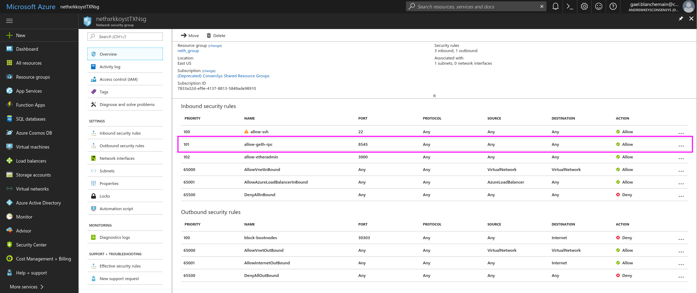
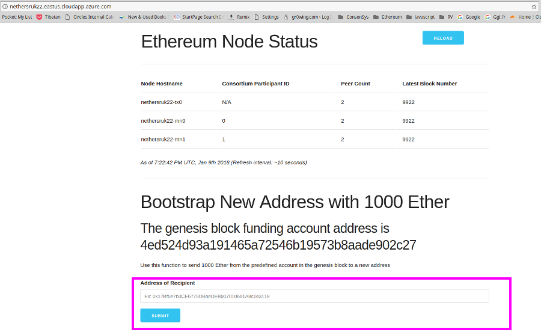

Nethereum supports Microsoft Azure, the below will show you how to deploy a private Blockchain on Azure and start interacting with it:

## 1 - Create an [Azure account](https://azure.microsoft.com/en-us/resources/videos/sign-up-for-microsoft-azure/) or [sign](https://azure.microsoft.com/en-us/account/) in if you already have one

## 2 - Create a new resource on your Azure dashboard


## 3 - In the resource search bar, enter ``` ethereum consortium blockchain ``` Select the ethereum consortium template, then click ‘Create’.


## 4 - Click create to confirm deployment model


## 5 - Enter the specifications of your blockchain, then click OK

### - Number of Consortium Members

The number of mining members in the network. Subnet will be formed for each mining member. (2 to 12 members)

### - Number of mining nodes per member

The number of mining nodes deployed per member.Total mining nodes = Members * Nodes Per Member. (1 to 15 nodes/member)

### - Mining node storage performance

Storage type for transaction db. (Standard or Premium)

### - Number of transaction nodes

The number of transaction nodes to be created. (1 to 5)

### - Transaction node storage performance

Storage type for transaction db. (Standard or Premium)

### - Transaction node storage replication

### - The storage replication policy. (LRS, GRS, RAGRS)

### - Transaction node virtual machine size
Size of transactional nodes VMs. (Standard A, Standard D, Standard D-v2,Standard F series, Standard DS, and Standard FS) 


## 6 - Submit a network id, some passwords, then click OK.
The network id should be ideally between 4 and 9 digits number.


## 7 - Review your blockchain's specs, then click OK.


## 8 - Agree (or not) to the Terms of use, give Azure servers a few minutes to deploy your chain.

It should take a few minutes for Azure to spin your chain.

## 9 - Connect to your Chain

Now that your chain is deployed, you can interact with it by creating a Web3 instance:
```csharp
var web3 = new Web3("http://nethxrkkoyst.eastus.cloudapp.azure.com:8545");
```
To retrieve your chain's URL, go to your Azure dashboard and select the Azure instance of the type: "Public IP Address" then "Overview". The URL provided is your chain


You can also retrieve or modify the port used to transact with your chain using RPC. On your Azure dashboard, select ``` Network Security Group ``` the RPC port will be on line ``` allow-geth-RPC ```




## 10 - Create an account on your deployed chain
You can easily create an Ethereum account and perform transactions with Nethereum. Use the following C# commands:

```csharp
var ecKey = Nethereum.Signer.EthECKey.GenerateKey();
var address = ecKey.GetPublicAddress();
```
This will return your new account's address, which should look like this:
``` "0xC33c96764640662A51d073347Df73546aCAb7715" ```
Now you can reveal the account's private key with: 
```csharp
var privateKey = ecKey.GetPrivateKey();
"0x42360260880d7be8d401552cc9e41020c726b10ee8d2622d138b09c86e29e7a5"
```
Next step is to create an `account` variable using your private key:
```csharp
var account = new Account("0xb5b1870957d373ef0eeffecc6e4812c0fd08f554b37b233526acc331bf1544f7");
```

Finally, to enable transactions using your new account, you can create a new Web3 instance using your account as variable:
```csharp
var web3 = new Web3(account);
```

## 11 - Set an account with some Ether

To start sending transactions, your newly created account will need some Ether. Azure BaaS automatically deploys an Ether Faucet which will provide any address with Ether.

The faucet's URL is the same as your chain's, it can be accessed from your browser.

Paste your account's address in, this should bootstrap your account with 1000 ETH.



