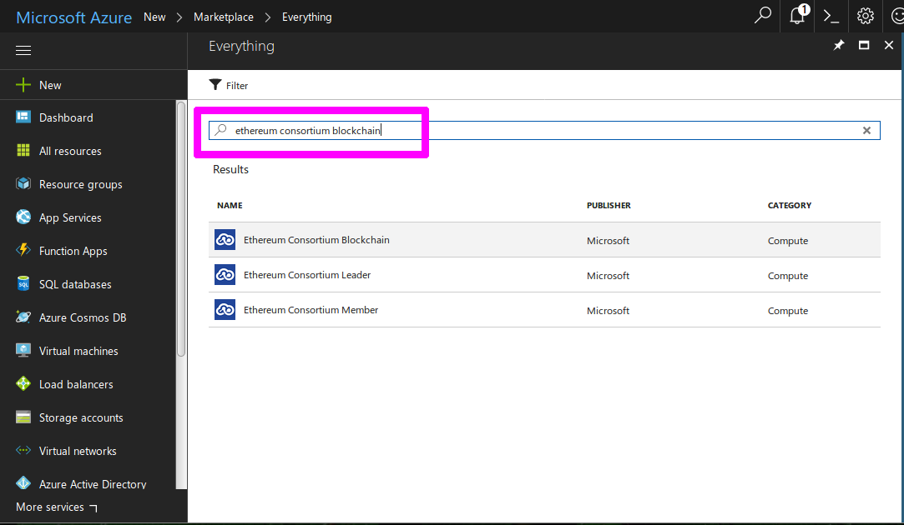
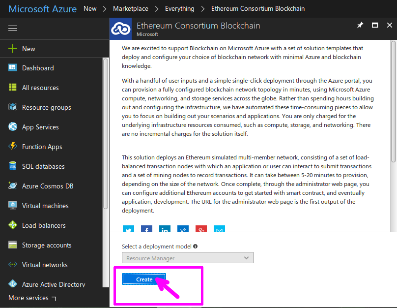
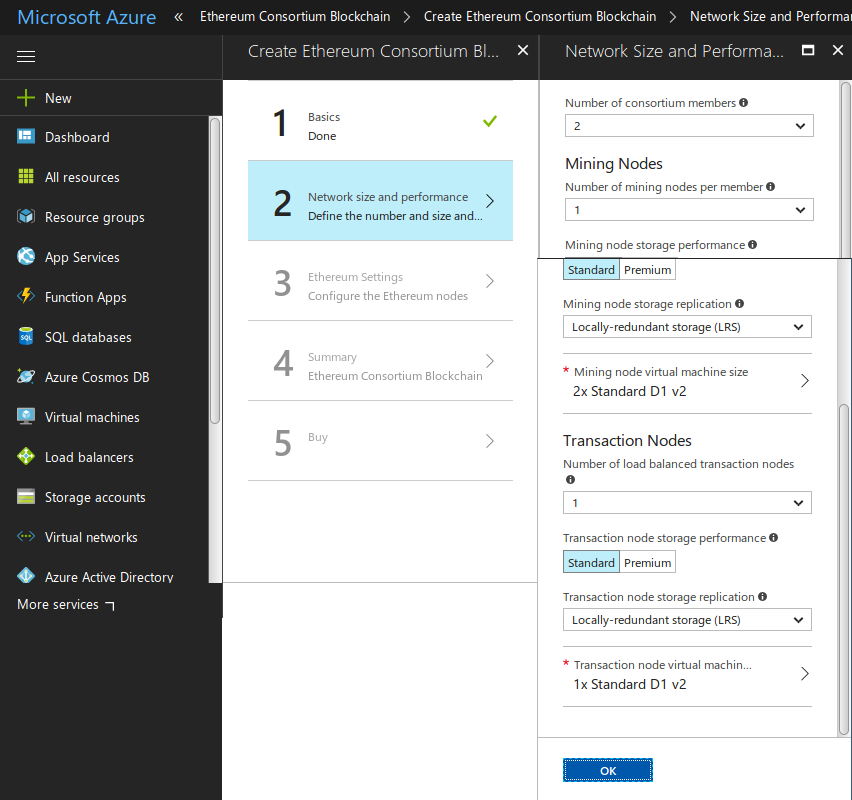
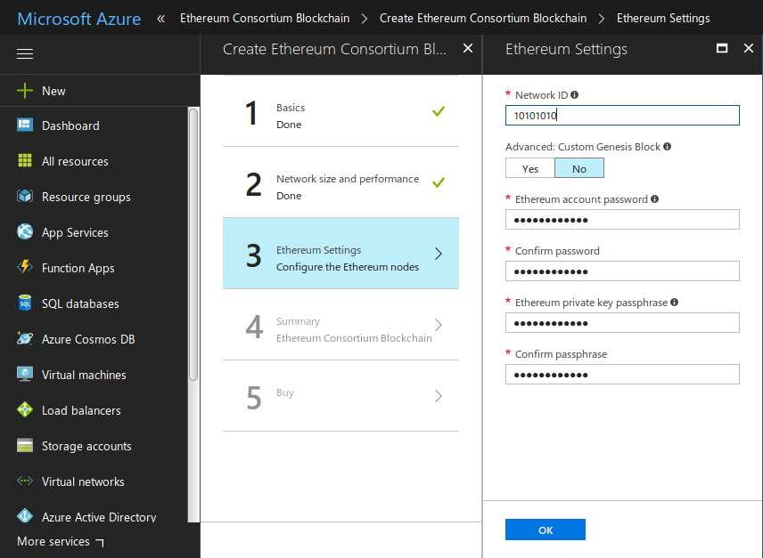
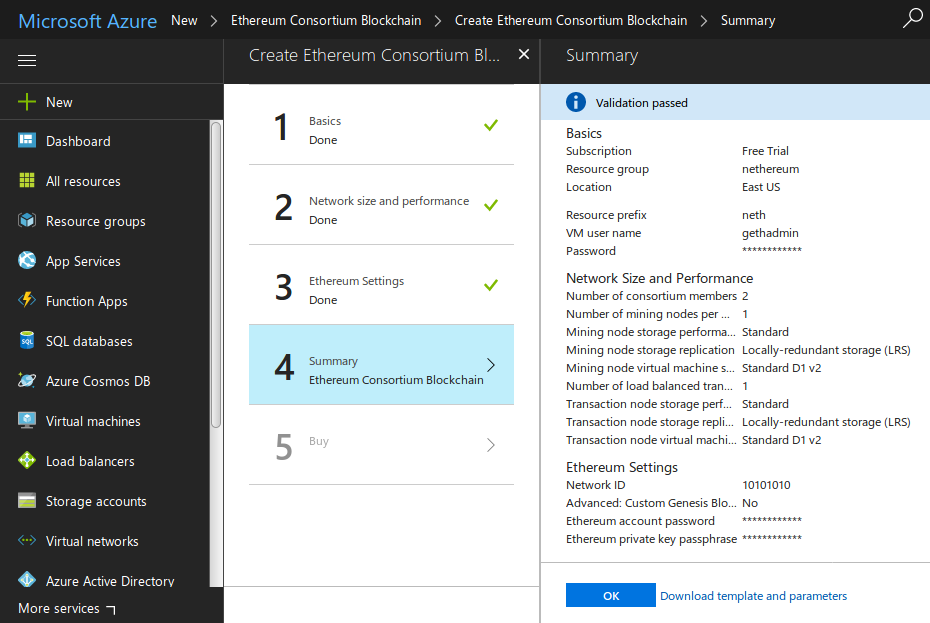
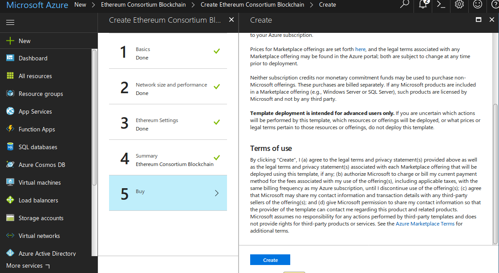
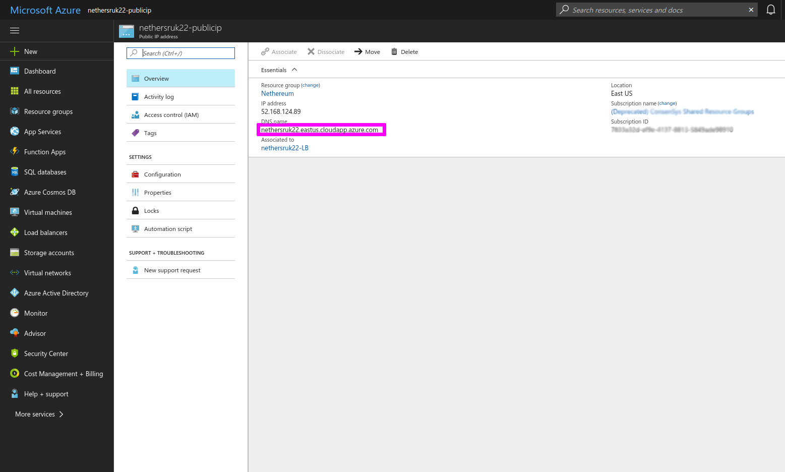

### Nethereum supports Microsoft Azure, which puts Azure infrastructure at the service of your Nethereum project, the below will show you how to deploy a private Blockchain on Azure:

## 1 - Create an [Azure account](https://azure.microsoft.com/en-us/resources/videos/sign-up-for-microsoft-azure/) or [sign](https://azure.microsoft.com/en-us/account/) in if you already have one

## 2 - Create a new resource on your Azure dashboard


## 3 - In the resource search bar, enter ``` ethereum consortium blockchain ``` Select the ethereum consortium template, then click ‘Create’.


## 4 - Click create to confirm deployment model


## 5 - Enter the specifications of your blockchain, then click OK

### - Number of Consortium Members

The number of mining members in the network. Subnet will be formed for each mining member. (2 to 12 members)

### - Number of mining nodes per member

The number of mining nodes deployed per member.Total mining nodes = Members * Nodes Per Member. (1 to 15 nodes/member)

### - Mining node storage performance

Storage type for transaction db. (Standard or Premium)

### - Number of transaction nodes

The number of transaction nodes to be created. (1 to 5)

### - Transaction node storage performance

Storage type for transaction db. (Standard or Premium)

### - Transaction node storage replication

### - The storage replication policy. (LRS, GRS, RAGRS)

### - Transaction node virtual machine size
Size of transactional nodes VMs. (Standard A, Standard D, Standard D-v2,Standard F series, Standard DS, and Standard FS) 


## 6 - Submit a network id, some passwords, then click OK.
The network id should be ideally between 4 and 9 digits number.


## 7 - Review your blockchain's specs, then click OK.


## 8 - Agree (or not) to the Terms of use, give Azure servers a few minutes to deploy your chain.

It should take a few minutes for Azure to spin your chain.

## 9 - Create an account on your deployed chain
Now that your chain is deployed, you will need at least one Ethereum account, you can easily create one using Nethereum. Just use the following C# commands:
``` 
var ecKey = Nethereum.Signer.EthECKey.GenerateKey();
var address = ecKey.GetPublicAddress();
 ```
This will return your new account's address, which should look like this: ``` 0xA13a6c3f36e09BcF41fd2Add9AB1B565b86834B1 ```

## 10 - Set an account with some Ether

To start sending transactions, your newly created account will need some Ether. Azure BaaS automatically deploys an Ether Faucet which will provide any address with Ether.

To retrieve your faucet's URL, go to your Azure dashboard and select the Azure instance of the type: "Public IP Address" then "Overview". The URL provided is your Ether faucet

Paste your account's address in, this should bootstrap your account with 1000 ETH.
