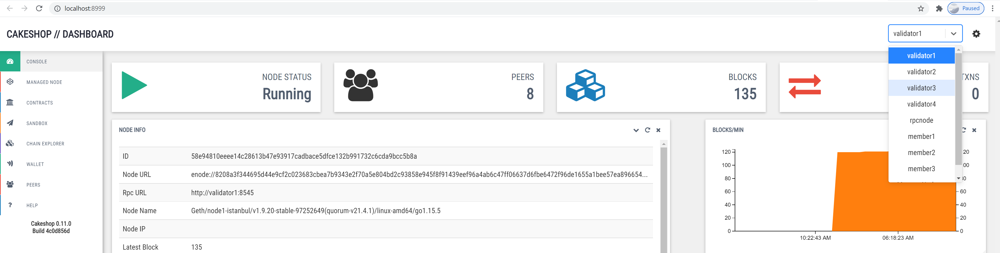

# Quorum

[Quorum](https://consensys.net/quorum/developers) is a brand name encompassing several products for private, permissioned, blockchains aimed at enterprise usage. Quorum focuses on privacy, unlike Ethereum mainnet which reveals all of its transactions in the clear, Quorum enables private transactions. Quorum products also offer other forms of consensus such as Proof-of-Authority.

[GoQuorum](https://docs.goquorum.consensys.net/en/stable/) is a private, permissioned, blockchain based on the official Go implementation of the Ethereum protocol. The GoQuorum client is a forked version of Ethereum's Geth. This page explains how to use **Nethereum** with **GoQuorum**. In the below, the term Quorum always refers to GoQuorum.

## Install a Local Quorum Network

The simplest and fastest way to setup an instance of Quorum is to use the [Quorum Dev Quickstart](https://github.com/ConsenSys/quorum-dev-quickstart). If you are using a Windows PC, the prerequisites are that you must have installed [WSL](https://docs.microsoft.com/en-us/windows/wsl/install-win10), [Docker for Windows](https://docs.docker.com/docker-for-windows/) and [Nodejs](https://nodejs.org/en/download/). This guide has been tested using WSL with Ubuntu 20.04.

After the prerequisites are installed the Quorum Dev Quickstart install is very simple. From a WSL shell (using [Windows Terminal](https://docs.microsoft.com/en-us/windows/terminal/get-started) is a useful tool for this) run the following:

```
$ npx quorum-dev-quickstart
```

You will be asked a series of questions about what sort of Quorum demo network you want to bring up. At the prompts, choose the answers '2. GoQuorum', then 'N' you don't want to try Orchestrate, then 'Y' to enable support for private transactions and finally choose 'N' to say no, you don't need logging with ELK.

The questions and answers should look like this:

```
Which Ethereum client would you like to run? Default: [1]
        1. Hyperledger Besu
        2. GoQuorum
2
Do you want to try out Codefi Orchestrate? Note: choosing yes will direct you to a login/registration page. [Y/n]
N
Do you wish to enable support for private transactions? [Y/n]
Y
Do you wish to enable support for logging with ELK (Elasticsearch, Logstash & Kibana)? [y/N]
N
Where should we create the config files for this network? Please
choose either an empty directory, or a path to a new directory that does
not yet exist. Default: ./quorum-test-network
```
## Run the Local Quorum Network
Now you can run the local Quorum network. The default Quickstart builds and runs a local Quorum consortium network running in Docker. There are 3 member nodes (sometimes called transaction nodes), 4 validator nodes and some supporting services like a block explorer and network health monitor. Each member node is paired with its own Tessera node. The Tessera nodes are what manage the private transactions.

Once the network is up and running we can use Nethereum to interact with the Quorum network. From a WSL shell prompt, run:
```
$ cd quorum-test-network
$ ./run.sh
```
Docker may take a minute to download what it needs, and eventually you should see these messages like this:
```
*************************************
Quorum Dev Quickstart
*************************************
----------------------------------
List endpoints and services
----------------------------------
JSON-RPC HTTP service endpoint      : http://localhost:8545
JSON-RPC WebSocket service endpoint : ws://localhost:8546
Web block explorer address          : http://localhost:25000/
Prometheus address                  : http://localhost:9090/graph
Grafana address                     : http://localhost:3000/d/a1lVy7ycin9Yv/goquorum-overview?orgId=1&refresh=10s&from=now-30m&to=now&var-system=All
Cakeshop toolkit address            : http://localhost:8999
```
Before exploring the network, the first thing to check is that Docker has managed to start all the containers correctly:

```
$ docker-compose ps
```
You should see output similar to the below. The main thing to look for is the `State` column where everything should show as `Up` or `Up (healthy)`:
```
                Name                              Command                  State     
-----------------------------------------------------------------------------------------
quorum-test-network_cakeshop_1         /bin/sh -c rm -rf /data/ca ...   Up (healthy)
quorum-test-network_ethsignerProxy_1   /opt/ethsigner/bin/ethsign ...   Up          
quorum-test-network_explorer_1         /docker-entrypoint.sh ngin ...   Up          
quorum-test-network_grafana_1          /run.sh                          Up          
quorum-test-network_member1quorum_1    /bin/sh -c                       Up (healthy)
quorum-test-network_member1tessera_1   /bin/sh -c mkdir -p /var/l ...   Up (healthy)
quorum-test-network_member2quorum_1    /bin/sh -c                       Up (healthy)
quorum-test-network_member2tessera_1   /bin/sh -c mkdir -p /var/l ...   Up (healthy)
quorum-test-network_member3quorum_1    /bin/sh -c                       Up (healthy)
quorum-test-network_member3tessera_1   /bin/sh -c mkdir -p /var/l ...   Up (healthy)
quorum-test-network_prometheus_1       /bin/prometheus --config.f ...   Up          
quorum-test-network_rpcnode_1          /bin/sh -c mkdir -p /var/l ...   Up (healthy)
quorum-test-network_validator1_1       /bin/sh -c mkdir -p /var/l ...   Up (healthy)
quorum-test-network_validator2_1       /bin/sh -c mkdir -p /var/l ...   Up (healthy)
quorum-test-network_validator3_1       /bin/sh -c mkdir -p /var/l ...   Up (healthy)
quorum-test-network_validator4_1       /bin/sh -c mkdir -p /var/l ...   Up (healthy)
```
There [is more documentation](https://github.com/ConsenSys/quorum-dev-quickstart/blob/master/files/gquorum/README.md) explaining more about how to use the network.

## Use CakeShop to Explore the Local Quorum Network
Now that Quorum network is up and running, we can use CakeShop to explore what nodes we have. In a browser enter `http://localhost:8999` to bring up the CakeShop application:



The dropdown menu at the top right allows you to switch between nodes.

# Using Nethereum with Quorum
With the Quorum network now running we can use Nethereum to interact with it.
## Get Latest Block Number
Add the nuget packages `Nethereum.Web3` and `Nethereum.Quorum` to your project, then use code as follows to retrieve the latest block number:

```csharp
using Nethereum.Quorum;
using Nethereum.Web3;
```
```csharp
var urlMember1 = "http://127.0.0.1:20000";
Web3Quorum web3Quorum = new Web3Quorum(urlMember1);            
HexBigInteger blockNumber = await web3Quorum.Eth.Blocks.GetBlockNumber.SendRequestAsync();
```
How did we know what the member1 URL was? The answer lies in the files that the Quorum Dev Quickstart generated for us earlier. If you look in WSL under the directory that was used during the Quickstart install, (the default is `quorum-test-network`) you will see a file called `docker-compose.yml`. In that file there is a heading `member1quorum` and a port number. The first ports row below shows the external port is 20000.

```
  member1quorum:
    << : *quorum-member-def
    ports:
      - 20000:8545/tcp
```

## Post a Private Transaction
As mentioned above, private transactions are managed by the Tessera nodes. A private transaction exists on the main chain, however the transaction payload only exists in the Tessera nodes of those members that were party to that transaction.

We are going to create a private transaction between member1 and member2. Member3 will not be able to see the details of this transaction. Before we can post the private transaction, we need to know:

1) the Tessera node URL for **member1**.

2) the Tessera public key of the member node that we want to share the transaction with, in this case **member2**.

To get these bits of information, we need to look again at the files that were generated for us by the Quickstart. For 1) we look again inside `docker-compose.yml` and find the heading `member1tessera1`:

```
  member1tessera:
    << : *tessera-def
    ports:
      - 9081:9080
```
We can see the external port is 9081.

For 2), if you look in directory `/quorum-test-network/config/quorum/networkFiles/member2` you will see a file called `tm.pub`. This file contains the public key of member2's Tessera node. This public key value is what we need:

```
$ cat tm.pub
QfeDAys9MPDs2XHExtc84jKGHxZg/aj52DTh0vtA3Xc=
```
Now in your C# project, you can start to code the private transaction. Start off by setting up a `Web3Quorum` as follows:
```csharp
// Setup a web3Quorum with read/write capability for member1
var urlMember1 = "http://127.0.0.1:20000";
var urlMember1Tessera = "http://127.0.0.1:9081";
// This private key can be any old value, since all accounts are open and gas is free
var privateKeyMember1 = "0x7580e7fb49df1c861f0050fae31c2224c6aba908e116b8da44ee8cd927b990b0";
var accountMember1 = new QuorumAccount(privateKeyMember1);
Web3Quorum web3Quorum = new Web3Quorum(accountMember1, urlMember1Tessera, urlMember1);

// Specify who will share in private transactions, in this case it is member2
var tesseraPublicKeyOfMember2 = @"QfeDAys9MPDs2XHExtc84jKGHxZg/aj52DTh0vtA3Xc=";
var privateFor = new List<string> { tesseraPublicKeyOfMember2 };
web3Quorum.SetPrivateRequestParameters(privateFor);
```
Now we have a `Web3Quorum` for member1 that is configured to share private transactions only with member2. If we had wanted to share the transaction with more members, we would add more keys to the **privateFor** `List` variable in the code above.

For this example, we will deploy a ERC20 token as our private transaction. First add the nuget package `Nethereum.StandardTokenEIP20` to your project, and add this code:
```csharp
using Nethereum.StandardTokenEIP20;
using Nethereum.StandardTokenEIP20.ContractDefinition;
```
```csharp
// Deploy contract
int expectedTotalSupply = 1_000_000;
var deploymentContract = new EIP20Deployment()
{
    InitialAmount = expectedTotalSupply,
    TokenName = "TestToken",
    TokenSymbol = "TEST"
};
StandardTokenService tokenServiceMember1 = await StandardTokenService.DeployContractAndGetServiceAsync(web3Quorum, deploymentContract);
string contractAddress = tokenServiceMember1.ContractHandler.ContractAddress;
Console.WriteLine(contractAddress);
```
Now the private contract is deployed, we can check that it is visible to member1 and member2, but not visible to member3. The port numbers for member2 and member3 are retrieved from `docker-compose.yml` in the same way that we retreived the port for member1.

```csharp
// Member1 can see total supply
int totalSupplyMember1 = (int)await tokenServiceMember1.TotalSupplyQueryAsync();
Console.WriteLine($"Member1 sees: {totalSupplyMember1}");

// Member2 can see total supply            
var urlMember2 = "http://127.0.0.1:20002";
var web3QuorumMember2 = new Web3Quorum(urlMember2);
var tokenServiceMember2 = new StandardTokenService(web3QuorumMember2, contractAddress);
int totalSupplyMember2 = (int)await tokenServiceMember2.TotalSupplyQueryAsync();
Console.WriteLine($"Member2 sees: {totalSupplyMember2}");

// Member 3 cannot see total supply
var urlMember3 = "http://127.0.0.1:20004";
var web3QuorumMember3 = new Web3Quorum(urlMember3);
var tokenServiceMember3 = new StandardTokenService(web3QuorumMember3, contractAddress);
int totalSupplyMember3 = (int)await tokenServiceMember3.TotalSupplyQueryAsync();
Console.WriteLine($"Member3 sees: {totalSupplyMember3}");
```
The above should show the following when run:
```
Member1 sees: 1000000
Member2 sees: 1000000
Member3 sees: 0
```

## Shutdown the Local Quorum Network
You use can `./stop.sh` and `./resume/sh` to halt and bring back up the network with data preserved. Use `./remove.sh` to halt and remove the network and `./run.sh` to bring up a clean empty network again.