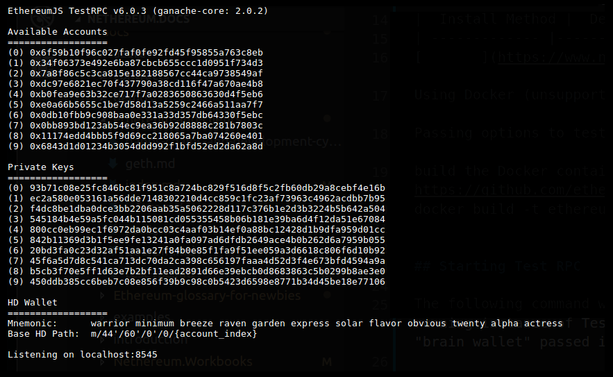

## Test RPC Configuration and usage

Ethereum TestRPC is a fast and customizable blockchain emulator. It allows making calls to the blockchain without the overheads of running an actual Ethereum node.

* Accounts can be re-cycled, reset and instantiated with a fixed amount of Ether (no need for faucets or mining).
* Gas price and mining speed can be modified.

### Get started

|  Install Method | Command |
| ------------- |---------|
|[via NPM](https://www.npmjs.com/package/ethereumjs-testrpc) |  ` npm install -g ethereumjs-testrpc `|
|Quicks start using Docker image (unsupported) | ` docker run -d -p 8545:8545 ethereumjs/testrpc:latest ` |
|Passing options to testrpc through Docker |  ` docker run -d -p 8545:8545 ethereumjs/testrpc:latest -a 10 --debug ` |
|Build the Docker container from source |  ` git clone https://github.com/ethereumjs/testrpc.git && cd testrpc docker build -t ethereumjs/testrpc ` |

## Starting Test RPC

The following command will start an instance of testrpc. Testrpc will automatically generate accounts from the seed phrases passed in with the -m switch.

` testrpc -m "small failure organs crooks zero delivery fired extreme lost twenty alpha terror" `

## Implemented Methods

Some of the RPC methods currently implemented are:

- ` bzz_hive (stub) `
- ` bzz_info (stub) `
- ` debug_traceTransaction `
- ` eth_accounts `
- ` eth_blockNumber `
- ` eth_call `
- ` eth_coinbase `
- ` eth_estimateGas `
- ` eth_gasPrice `
- ` eth_getBalance `
- ` eth_getBlockByNumber `
- ` eth_getBlockByHash `
- ` eth_getBlockTransactionCountByHash `
- ` eth_getBlockTransactionCountByNumber `
- ` eth_getCode (only supports block number “latest”) `
- ` eth_getCompilers `
- ` eth_getFilterChanges `
- ` eth_getFilterLogs `
- ` eth_getLogs `
- ` eth_getStorageAt `
- ` eth_getTransactionByHash `
- ` eth_getTransactionByBlockHashAndIndex `
- ` eth_getTransactionByBlockNumberAndIndex `
- ` eth_getTransactionCount `
- ` eth_getTransactionReceipt `
- ` eth_hashrate `
- ` eth_mining `
- ` eth_newBlockFilter `
- ` eth_newFilter (includes log/event filters) `
- ` eth_protocolVersion `
- ` eth_sendTransaction `
- ` eth_sendRawTransaction `
- ` eth_sign `
- ` eth_syncing `
- ` eth_uninstallFilter `
- ` net_listening `
- ` net_peerCount `
- ` net_version `
- ` miner_start `
- ` miner_stop `
- ` personal_listAccounts `
- ` personal_lockAccount `
- ` personal_newAccount `
- ` personal_unlockAccount `
- ` personal_sendTransaction `
- ` shh_version `
- ` rpc_modules `
- ` web3_clientVersion `
- ` web3_sha3 `

There’s also special non-standard methods that aren’t included within the original RPC specification:

|Method|Definition|
|--------|----|
|evm_snapshot : |Snapshot the state of the blockchain at the current block. Takes no parameters. Returns the integer id of the snapshot created.|
| evm_revert :| Revert the state of the blockchain to a previous snapshot. Takes a single parameter, which is the snapshot id to revert to. If no snapshot id is passed it will revert to the latest snapshot. Returns true.|
|evm_increaseTime:| Jump forward in time. Takes one parameter, which is the amount of time to increase in seconds. Returns the total time adjustment, in seconds.|
|evm_mine : |Force a block to be mined. Takes no parameters. Mines a block independent of whether or not mining is started or stopped. Unsupported Methods.|
|eth_compileSolidity:| If you'd like Solidity compilation in Javascript, please see the solc-js project. Docker.|
