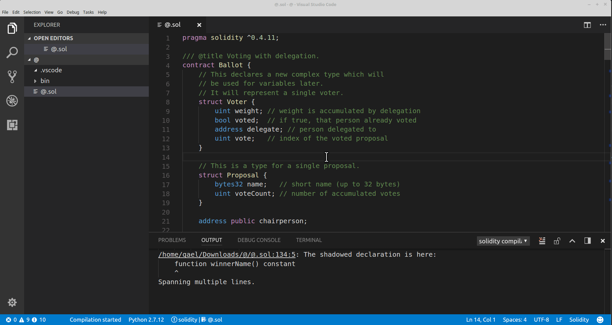

# Nethereum Code Generator

Nethereum offers a code generator which allows you to generates C# classes from the ABI and Bin output of the compilation of Solidity contracts.

The "smart contract c# service code generator" generates a generic C# service to interact with the smart contract, including Deployment, access to Functions and Events.

There are two types of code generators a JavaScript one, which is integrated on the Visual Studio Code Solidity extension and a .Net console application

## Code generation using the Visual Studio Code extension

Prerequisites: 

* [Visual Studio Code (windows/Linux or Mac)](https://code.visualstudio.com/) 
* [Solidity vscode extension](https://marketplace.visualstudio.com/items?itemName=JuanBlanco.solidity).
* A solidity smart contract [(like any of these)](http://solidity.readthedocs.io/en/develop/solidity-by-example.html)

### Step 1:

In visual studio code, open the command palette with ``` Ctrl+Shift+P ```. then type "solidity" and select "compile current Solidity contract".


You should now see a newly generated ``` bin ``` folder containing three generated files.

### Step 2:

Select the Json files contained in ``` bin ```, then open the command palette, type solidity and select ``` code generate from compilation output 'YourFile.json'```



You're done :)

## Code generation using the Console application.

Prerequisites: 

* Download the console application from the [releases page of Nethereum](https://github.com/Nethereum/Nethereum/releases)
* Install the .net CLI if you don't have already
* An ABI and a BIN file output from the compilation.

Then simply use the command:

```dotnet Nethereum.Generator.Console.dll gen-service -af UportRegistry.abi -bf UportRegistry.bin -c UportRegistry -n Uport```

In this scenario the parameters are:

* gen-service (the type of code generator)
* -af (the abi file name)
* -bf (the bin file name)
* -c (the class name)
* -n (the Namespace name)

A sample and source code can be found [here](https://github.com/Nethereum/Nethereum/tree/master/src/Nethereum.Generator.Console), feel free to contribute new code generators.


