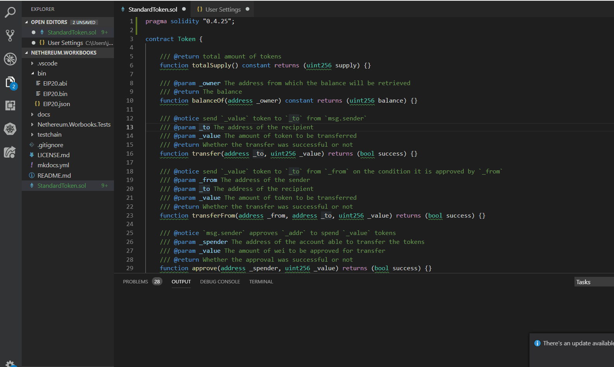

# Nethereum Code Generator

Nethereum offers a code generator which allows you to generates C# classes from the ABI and Bin output of the compilation of Solidity contracts.

The "smart contract c# service code generator" generates a generic C# service to interact with the smart contract, including Deployment, access to Functions and Events.

There are two types of code generators: a JavaScript one, which is integrated on the Visual Studio Code Solidity extension and a .Net console application

## Code generation using the Visual Studio Code extension

Prerequisites: 

* [Visual Studio Code (windows/Linux or Mac)](https://code.visualstudio.com/) 
* [Solidity vscode extension](https://marketplace.visualstudio.com/items?itemName=JuanBlanco.solidity).
* A solidity smart contract [(like any of these)](http://solidity.readthedocs.io/en/develop/solidity-by-example.html)

### Step 1:

In visual studio code, open the command palette with ``` Ctrl+Shift+P ```. then type "solidity" and select "compile current Solidity contract".


You should now see a newly generated ``` bin ``` folder containing three generated files.

### Step 2 Single contract:

Select the Json files contained in ``` bin ```, then open the command palette, type solidity and select ``` Solidity: Code generate CSharp from compilation output "contract.json"```

If you work in Vb.Net or FSharp chose those instead.




### Step 2 Multiple contracts

Open the command palette, type solidity and select ``` Solidity: Code generate CSharp project from all compiled files```

If you work in Vb.Net or FSharp chose those instead.

If you want to adjust your namespace and project name you can do it by including a file named "nethereum-gen.settings" including:

```javascript
{
    "projectName" : "YourProjectName"
    "namespace" : "YourNamespace"
}
```


## Code generation using the Console application

*Nethereum.Generator.Console*

A dot net core CLI tool which can be run in isolation or installed as a .net tool.

Source Code: [https://github.com/Nethereum/Nethereum/tree/master/src/Nethereum.Generator.Console]

Prerequisites:
* [Net Core 2.1](https://www.microsoft.com/net/download)

It currently supports a primary command called "generate" with the following sub commands:

* [from-abi](#from-abi)
* [from-project](#from-project)

### Installing the console as a dot net tool (optional)

The example below installs Nethereum.Generator.Console as a global tool (-g) and references a local folder as a nuget package source (--add-source).

Having a tool makes it easy to call the code generator from anywhere.
It is especially useful for automated builds and integration scripts.

Installing the tool 

The tool will shortly be available as a package from nuget.  For now, clone the source code and run ```dotnet pack``` to generate a nuget file (nupkg) locally.
```
dotnet tool install -g --add-source C:\dev\repos\nethereum\src\Nethereum.Generator.Console\bin\Release Nethereum.Generator.Console
```

### Accessing the 'Help'

```
Options:
  -h | -? | --help  Show help information
```

#### from-abi

Generates Nethereum code based based on a single abi.

```
Usage: generate from-abi [options]

Options:
  -cn | --contractName  The contract name (Optional)
  -abi | --abiPath      The abi file and path (Mandatory)
  -bin | --binPath      The bin file and path (Optional)
  -o | --outputPath     The output path for the generated code (Mandatory)
  -ns | --namespace     The base namespace for the generated code (Mandatory)
  -sf | --SingleFile    Generate the message definition in a single file (Optional - default is true)
  -? | -h | --help      Show help information
```

**Example**

Create a folder and place your abi and bin files in it.  Go to the folder in the command line.

Sample Compiled Solidity Files:
* [StandardContract.abi](sample-contracts/StandardContract.abi)
* [StandardContract.bin](sample-contracts/StandardContract.bin)

Invoke the generator with minimum args.
```
Nethereum.Generator.Console generate from-abi -abi StandardContract.abi -o . -ns Sample.Ethereum
```

After code generation


#### from-project

This command searches for abi files within a project and generates Nethereum code based on them.

Generated code has namespaces and names which are based on the abi files and project structure.

```
Usage: generate from-project [options]

Options:
  -p | --projectPath   The full project file path or path to the project folder (Optional - default is current directory).
  -a | --assemblyName  The output assembly name for the project (Optional - can be infered from project).
  -? | -h | --help     Show help information

```

**Example**

The example below generates Nethereum .net code from the StandardContract.abi in a .net project folder.
These instructions require .net core 2.1 to be installed.

Sample Compiled Solidity Files:
* [StandardContract.abi](sample-contracts/StandardContract.abi)
* [StandardContract.bin](sample-contracts/StandardContract.bin)

Steps:
- create new folder  ``` mkdir MyStandardContractProject ```
- navigate to folder ``` cd MyStandardContractProject ```
- IMPORTANT - copy and paste your abi and bin files into folder
- Create a dot net class library ``` dotnet new classLib ```
- Add Nethereum.Web3 as a dependency ``` dotnet add package -v 3.0.0-rc1 Nethereum.Web3 ```
- Generate the code ``` Nethereum.Generator.Console generate from-project ```
- Build the code ``` dotnet build ```

Folder contents - after code generation.


**Config driven generation**

The [from-project](#from-project) command will reference an optional config file for greater control over code generation.

If a file called "Nethereum.Generator.json" is present in the project directory, the generator will use those settings.

Example Nethereum.Generator.json config file.
``` json
{
	"ABIConfigurations":
	[
		{
			"ContractName":"StandardContractA",
			"ABI":null,
			"ABIFile":"solidity\\StandardContract.abi",
			"ByteCode":null,
			"BinFile":null,
			"BaseNamespace":null,
			"CQSNamespace":null,
			"DTONamespace":null,
			"ServiceNamespace":null,
			"CodeGenLanguage":"CSharp",
			"BaseOutputPath":null
		}
	]
}
```

### Interacting with the generated code

The code below uses the generated code to deploy a standard contract to a test chain and invoke its Transfer function.
(To run the code you need to ensure you have a test chain/node running and that you provide valid account addresses and passwords)

``` csharp
using System;
using System.Numerics;
using System.Threading.Tasks;
using MyStandardContractProject.StandardContract.CQS;
using MyStandardContractProject.StandardContract.Service;
using Nethereum.Hex.HexTypes;
using Nethereum.Web3;
using Nethereum.Web3.Accounts;
using Nethereum.Web3.Accounts.Managed;

namespace MyStandardContractProject
{
    public class Sample
    {
        public async Task DeployAndCall()
        {
            var account = new ManagedAccount("0x12890d2cce102216644c59dae5baed380d84830c", "password");
            var web3 = new Web3(account, "http://localhost:8545");

            var deployment = new StandardContractDeployment
            {
                InitialAmount = new HexBigInteger(100),
                TokenName = "Test",
                DecimalUnits = 0,
                TokenSymbol = "T"
            };

            var svc =
                await StandardContractService.DeployContractAndGetServiceAsync(web3, deployment);

            var receipt = await svc.TransferRequestAndWaitForReceiptAsync(new TransferFunction
            {
                To = "0x13f022d72158410433cbd66f5dd8bf6d2d129924",
                Value = new BigInteger(1)
            });

            if (receipt.Status.Value == 0)
                throw new Exception("Failure - status should equal 1");
        }
    }
}
```
