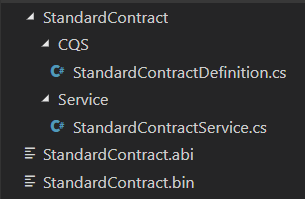

# Nethereum code generation using the Console application

*Nethereum.Generator.Console*

A dotnet core CLI tool which can be run in isolation or installed as a dotnet. It is especially useful for automated builds and integration scripts.

Source Code: [https://github.com/Nethereum/Nethereum/tree/master/generators/Nethereum.Generator.Console]

Prerequisites:

* [Net Core 2.1](https://www.microsoft.com/net/download)

It currently supports a primary command called "generate" with the following sub commands:

* [from-abi](#from-abi)
* [from-project](#from-project)

### Installing the console as a dotnet tool (optional)

The example below installs Nethereum.Generator.Console as a global tool (-g) and references a local folder as a nuget package source (--add-source).

### Installing the tool 

```
dotnet tool install -g Nethereum.Generator.Console
```

### Accessing the 'Help'

```
Nethereum.Generator.Console -h
```

### Commands

#### from-abi

Generates Nethereum code based on a single abi.

```
Usage: generate from-abi [options]

Options:
  -cn | --contractName  The contract name (Optional)
  -ABi | --ABiPath      The ABi file and path (Mandatory)
  -bin | --binPath      The bin file and path (Optional)
  -o | --outputPath     The output path for the generated code (Mandatory)
  -ns | --namespace     The base namespace for the generated code (Mandatory)
  -sf | --SingleFile    Generate the message definition in a single file (Optional - default is true)
  -? | -h | --help      Show help information
```

**Example**

Create a folder and place your ABi and bin files in it. Go to the folder in the command line.

Sample Compiled Solidity Files:

* [StandardContract.abi](https://github.com/Nethereum/Nethereum/tree/master/generators/Nethereum.Generator.Console/sample/StandardContract.abi)
* [StandardContract.bin](https://github.com/Nethereum/Nethereum/tree/master/generators/Nethereum.Generator.Console/sample/StandardContract.bin)

Invoke the generator with minimum args
```
Nethereum.Generator.Console generate from-abi -abi ./StandardContract.abi -o . -ns Sample.Ethereum
```

Folder contents - after code generation:



#### from-project

This command searches for ABI files within a project and generates Nethereum code based on them.

Generated code has namespaces and names which are based on the ABi files and project structure.

```
Usage: generate from-project [options]

Options:
  -p | --projectPath   The full project file path or path to the project folder (Optional - default is current directory).
  -a | --assemblyName  The output assembly name for the project (Optional - can be infered from project).
  -? | -h | --help     Show help information
```

**Example**

The example below generates Nethereum .net code from the StandardContract.ABi in a .net project folder.
These instructions require .net core 2.1 to be installed.

Sample Compiled Solidity Files:

* [StandardContract.abi](https://github.com/Nethereum/Nethereum/tree/master/generators/Nethereum.Generator.Console/sample/StandardContract.abi)
* [StandardContract.bin](https://github.com/Nethereum/Nethereum/tree/master/generators/Nethereum.Generator.Console/sample/StandardContract.bin)

Steps:
1. create new folder:
``` 
mkdir MyStandardContractProject 
```
2. navigate to folder: 
``` 
cd MyStandardContractProject 
```
!!! warning
    copy and paste your ABI and bin files into folder
     
3. Create a dotnet class library: 

``` 
dotnet new classLib 
```
4. Add Nethereum.Web3 as a dependency: 
```
dotnet add package Nethereum.Web3
```
5. Generate the code: 
```
Nethereum.Generator.Console generate from-project
```
6. Build the code: 
``` 
dotnet build 
```

Folder contents - after code generation:


**Config driven generation**

The [from-project](#from-project) command will reference an optional config file for greater control over code generation.

If a file called "Nethereum.Generator.json" is present in the project directory, the generator will use those settings.

Example Nethereum.Generator.json config file.
``` json
{
	"ABIConfigurations":
	[
		{
			"ContractName":"StandardContractA",
			"ABI":null,
			"ABIFile":"solidity\\StandardContract.ABi",
			"ByteCode":null,
			"BinFile":null,
			"BaseNamespace":null,
			"CQSNamespace":null,
			"DTONamespace":null,
			"ServiceNamespace":null,
			"CodeGenLanguage":"CSharp",
			"BaseOutputPath":null
		}
	]
}
```
