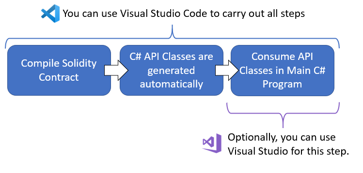
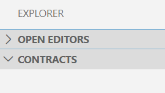
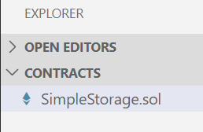
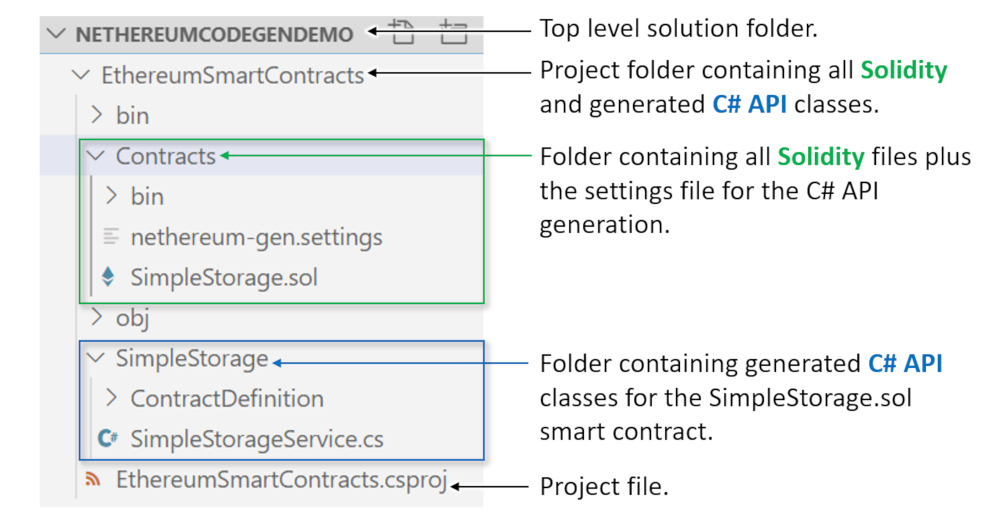
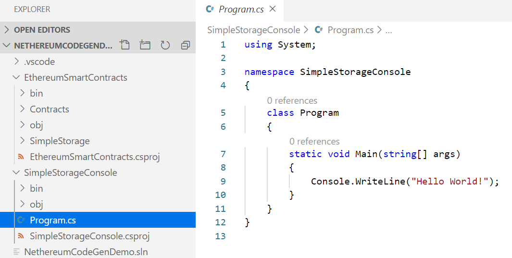

# Code Generation Demo with Visual Studio Code

## Prerequisites

* You have [Visual Studio Code (Windows, Linux or Mac)](https://code.visualstudio.com/) installed.

Imagine your goal is to take the contract called 
[SimpleStorage.sol](https://solidity.readthedocs.io/en/v0.5.7/introduction-to-smart-contracts.html#storage-example)
 from the Solidity documentation and call its functions from a C# project.

## Overview
You will prepare a Solidity contract in Visual Studio Code (VS Code) and compile it. The compilation process will automatically generate some C# API classes. These classes can then be consumed in a VS Code or Visual Studio C# project:



The diagram above shows these steps:

 * Write Solidity smart contracts and compile them in VS Code.

 * Configure the Solidity plugin for VS Code to automatically generate C# API classes that provide access to the smart contracts. This configuration only needs done once.

 * Use VS Code or Visual Studio to write C# to call methods from the generated C# API classes. This demo will use a .NET Core console program to call the API classes. In this document the term `function` refers to a Solidity function and `method` refers to a C# method.

## Initial Setup

 1. Create a folder for the top level solution. You will add a `.sln` solution file later.
```
md NethereumCodeGenDemo
cd NethereumCodeGenDemo
```

 2. Create a folder for the contracts project. This project will hold the Solidity source files _and_ their associated generated C# API code. The `.csproj` project file will be generated for you later.
```
md EthereumSmartContracts
cd EthereumSmartContracts
```

 3. Create a subfolder for the Solidity contracts:
```
md Contracts
```

 4. Open Visual Studio Code.

 5. Open extensions and install the [Solidity extension here](https://marketplace.visualstudio.com/items?itemName=JuanBlanco.solidity) if it is not already installed.

 6. Using VS Code, open folder `Contracts`. To begin with, VS Code shows you just an empty tree:



 7. If at any time, VS Code shows popups asking things like “Required assets to build and debug are missing from ‘SimpleStorage’. Add them?” say yes.

 8. Create a new file (ctrl+N).
 
 9. Paste the following solidity code into the file:
```
pragma solidity >=0.4.0 <0.7.0;

contract SimpleStorage {
    uint storedData;

    function set(uint x) public {
        storedData = x;
    }

    function get() public view returns (uint) {
        return storedData;
    }
}
```

 10. Save the file as `SimpleStorage.sol` in the `Contracts` folder. The contract code is from the 
[Solidity documentation](https://solidity.readthedocs.io/en/v0.5.7/introduction-to-smart-contracts.html#storage-example)
 and you can see it is a very simple contract, containing just two functions, `set()` and `get()`. VS Code should show the newly saved file in the tree like this:
 
 

 11. Press F1 and choose option `Solidity: Create 'nethereum-gen.settings' with default values at root`. This creates the Nethereum settings file to control the API generation. If VS Code says "the marketplace has extensions that can help with .settings files" choose "Dont show again". Edit the settings file to look like this, then save it:
```
{
    "projectName": "EthereumSmartContracts",
    "namespace": "EthereumSmartContracts.Contracts",
    "lang": 0,
    "autoCodeGen": true,
    "projectPath": "../"
}
```

## Compile Contract
You are now ready to compile the contract.
 1. In VS Code, select the `SimpleStorage.sol` file from the tree.
 2. Press F1 and choose option `Solidity: Compile Current Solidity Contract`. This compiles the Solidity contract and the C# API classes are automatically generated at the same time. You should see a message saying "Compilation completed successfully".
 3. The very first time you do step 2 above, you also need to upgrade the Nethereum NuGet version in the generated project. To do this, open a command prompt in folder `\NethereumCodeGenDemo\EthereumSmartContracts` and enter:
```
dotnet add package Nethereum.Web3
```
## Review What You've Built
You can now review what you've built so far.  In VS Code, open the top level solution folder `\NethereumCodeGenDemo` and you should see a tree like this:



The contract is now compiled and the C# API classes have been generated. The generated `SimpleStorageService` class contains some useful methods for interacting with the contract:

| To do this | Call this C# Method |
|--|--|
| Deploy contract | DeployContractAndWaitForReceiptAsync() |
| Call function set() | SetRequestAndWaitForReceiptAsync() |
| Call function get() | GetQueryAsync() |

Notice the C# method naming is different for the `set()` and `get()` function calls. This is because 
`set()` changes a value on the blockchain so it has be called using a transaction which costs Ether and can return a receipt. The `get()` function doesn't change any values on the blockchain so it is a simple query call. Queries are free, there are no transaction and no receipt.

Next you will consume this new API in a console program.
 
## Create Console Project
Now you will create a solution file and add a console project to try out the generated API. Open a command prompt in the top level solution folder `\NethereumCodeGenDemo` and follow these steps:

(1.) Create Solution file:
```
dotnet new sln --name NethereumCodeGenDemo
```
(2.) Add new Console project:
 ```
dotnet new console --name SimpleStorageConsole
dotnet sln add .\SimpleStorageConsole\SimpleStorageConsole.csproj
dotnet sln add .\EthereumSmartContracts\EthereumSmartContracts.csproj
```
(3.) Add references to the Console project:
```
cd SimpleStorageConsole
dotnet add package Nethereum.Web3
dotnet add reference ..\EthereumSmartContracts\EthereumSmartContracts.csproj
```

(4.) You are now ready to add some code to the `Program.cs` file in the `SimpleStorageConsole` project. If you prefer you could use Visual Studio to do this, but for this demo VS Code will be used. So in VS Code, open the top level solution folder `\NethereCodeGenDemo` and select the `Program.cs` file from the `SimpleStorageConsole` project. You should see something like this:



(5.) Paste the code below into `Program.cs`, replacing everything that is currently there. The code below uses the generated C# API code (notice the `using EthereumSmartContracts.Contracts.SimpleStorage` statement) to create a `SimpleStorageService` object. That object is then used to retrieve the latest stored value from the contract.

```csharp
using EthereumSmartContracts.Contracts.SimpleStorage;
using EthereumSmartContracts.Contracts.SimpleStorage.ContractDefinition;
using Nethereum.Web3;
using Nethereum.Web3.Accounts;
using System;
using System.Threading.Tasks;

namespace SimpleStorageConsole
{
    class Program
    {
        static void Main(string[] args)
        {
            Demo().Wait();
        }

        static async Task Demo()
        {
            try
            {
                // Setup
                var url = "https://rinkeby.infura.io/v3/7238211010344719ad14a89db874158c";
                var web3 = new Web3(url);
                // An already-deployed SimpleStorage.sol contract on Rinkeby:
                var contractAddress = "0xb52Fe7D1E04fbf47918Ad8d868103F03Da6ec4fE";
                var service = new SimpleStorageService(web3, contractAddress);

                // Get the stored value
                var currentStoredValue = await service.GetQueryAsync();
                Console.WriteLine($"Contract has value stored: {currentStoredValue}");
            }
            catch (Exception ex)
            {
                Console.WriteLine(ex.ToString());
            }

            Console.WriteLine("Finished");
            Console.ReadLine();
        }
    }
}
```
You are now ready to build the solution and run the above program.

## Build Solution and Run Console Project
Open a command prompt in the top level solution folder `\NethereumCodeGenDemo` and enter:
```
dotnet build
```
You should eventually see a message `Build succeeded`. Next:
```
cd SimpleStorageConsole
dotnet run
```
The output should be similar to the below. The actual value 42 depends what was last stored there, so may be different or zero:
```
Contract has value stored: 42
Finished
```
Well done! You have written a smart contract, generated a C# API for it, and consumed that API in a regular C# console program.

## Where to go from here
There are many more demos available over on the [Nethereum Playground](http://playground.nethereum.com/).

The purpose of this demo was to show code generation. However, you could try to extend the console program in this demo to also _deploy_ the `SimpleStorage` contract and _change_ the stored value inside it. This can be done using other methods from the generated `SimpleStorageService` class. To get you started, try replacing the `Demo` method in `Program.cs` with the code below, and then running it: 
```
static async Task Demo()
{
    try
    {
        // Setup using the Nethereum public test chain
        var url = "http://testchain.nethereum.com:8545";
        var privateKey = "0x7580e7fb49df1c861f0050fae31c2224c6aba908e116b8da44ee8cd927b990b0";
        var account = new Account(privateKey);
        var web3 = new Web3(account, url);

        Console.WriteLine("Deploying...");
        var deployment = new SimpleStorageDeployment();
        var receipt = await SimpleStorageService.DeployContractAndWaitForReceiptAsync(web3, deployment);
        var service = new SimpleStorageService(web3, receipt.ContractAddress);
        Console.WriteLine($"Contract Deployment Tx Status: {receipt.Status.Value}");
        Console.WriteLine($"Contract Address: {service.ContractHandler.ContractAddress}");
        Console.WriteLine("");

        Console.WriteLine("Sending a transaction to the function set()...");
        var receiptForSetFunctionCall = await service.SetRequestAndWaitForReceiptAsync(new SetFunction() { X = 42, Gas = 400000 });
        Console.WriteLine($"Finished storing an int: Tx Hash: {receiptForSetFunctionCall.TransactionHash}");
        Console.WriteLine($"Finished storing an int: Tx Status: {receiptForSetFunctionCall.Status.Value}");
        Console.WriteLine("");

        Console.WriteLine("Calling the function get()...");
        var intValueFromGetFunctionCall = await service.GetQueryAsync();
        Console.WriteLine($"Int value: {intValueFromGetFunctionCall} (expecting value 42)");
        Console.WriteLine("");
    }
    catch (Exception ex)
    {
        Console.WriteLine(ex.ToString());
    }

    Console.WriteLine("Finished");
    Console.ReadLine();
}
```     


 
