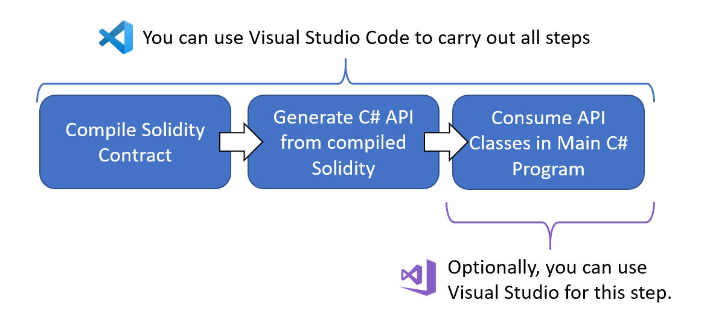

# Code Generation Demo with Visual Studio Code

## Prerequisites

* You have [Visual Studio Code (Windows, Linux or Mac)](https://code.visualstudio.com/) installed.

Imagine your goal is to take the contract called 
[SimpleStorage.sol](https://solidity.readthedocs.io/en/v0.5.7/introduction-to-smart-contracts.html#storage-example)
 from the Solidity documentation and call its functions from a C# project.

## Overview
You will prepare a Solidity contract in Visual Studio Code (VS Code) and compile it. The compilation process will automatically generate some C# API classes. These classes can then be consumed in a VS Code or Visual Studio C# project:



The diagram above shows these steps:

 * Write Solidity smart contracts and compile them in VS Code.

 * Configure the Solidity plugin for VS Code to automatically generate C# API classes that provide access to the smart contracts. This configuration only needs done once.

 * Use VS Code or Visual Studio to write C# to call methods from the generated C# API classes.

## Initial Setup

 1. Create a folder structure as shown below:


 2. Open Visual Studio Code.

 3. Open extensions and install the [Solidity extension here](https://marketplace.visualstudio.com/items?itemName=JuanBlanco.solidity) if it is not already installed.

 4. Using VS Code, open the folder `Contracts` that you just created in step 1 above. To begin with, VS Code shows you just an empty tree:


 5. If at any time, VS Code shows popups asking things like “Required assets to build and debug are missing from ‘SimpleStorage’. Add them?” say yes.

 6. Create a new file (ctrl+N).
 
 7. Paste the following solidity code into the file:
```
pragma solidity >=0.4.0 <0.7.0;

contract SimpleStorage {
    uint storedData;

    function set(uint x) public {
        storedData = x;
    }

    function get() public view returns (uint) {
        return storedData;
    }
}
```

 8. Save the file as `SimpleStorage.sol` in the `Contracts` folder. The contract code is from the 
[Solidity documentation](https://solidity.readthedocs.io/en/v0.5.7/introduction-to-smart-contracts.html#storage-example)
 and you can see it is a very simple contract, containing just two functions, `set()` and `get()`. VS Code should show the newly saved file in the tree like this:
 
 

 9. Press F1 and choose option `Solidity: Create 'nethereum-gen.settings' with default values at root`. This creates the Nethereum settings file to control the API generation. If VS Code says "the marketplace has extensions that can help with .settings files" choose "Dont show again". Edit the settings file to look like this, then save it:
```
{
    "projectName": "EthereumSmartContracts",
    "namespace": "EthereumSmartContracts.Contracts",
    "lang": 0,
    "autoCodeGen": true,
    "projectPath": "../"
}
```

## Compile Contract
You are now ready to compile the contract.
 1. In VS Code, select the `SimpleStorage.sol` file from the tree.
 2. Press F1 and choose option `Solidity: Compile Current Solidity Contract`. This compiles the Solidity contract and the C# API classes are automatically generated at the same time. You should see a message saying "Compilation completed successfully".
 3. The very first time you do step 2 above, you also need to upgrade the Nethereum NuGet version in the generated project. To do this, open a command prompt in folder `\NethereumCodeGenDemo\EthereumSmartContracts` and enter:
```
dotnet add package Nethereum.Web3
```
## Review What You've Built
You can now review what you've built so far.  In VS Code, open the top level solution folder `\NethereumCodeGenDemo` and you should see a tree like this:


The contract is now compiled and the C# API classes have been generated. The generated `SimpleStorageService` class contains some useful methods for interacting with the contract:

| To do this | Call this C# Method |
|--|--|
| Deploy contract | DeployContractAndWaitForReceiptAsync() |
| Call function set() | SetRequestAndWaitForReceiptAsync() |
| Call function get() | GetQueryAsync() |

Notice the C# method naming is different for the `set()` and `get()` function calls. This is because 
`set()` changes a value on the blockchain so it has be called using a transaction which costs Ether and can return a receipt. The `get()` function doesn't change any values on the blockchain so it is a simple query call. Queries are free, there are no transaction and no receipt.

You have now written a smart contract and generated a C# API for it. This C# API can now be used as desired.

## Where to go from here
There are many more demos available over on the [Nethereum Playground](http://playground.nethereum.com/).
