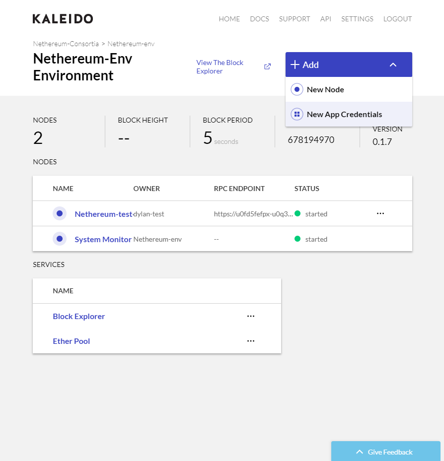
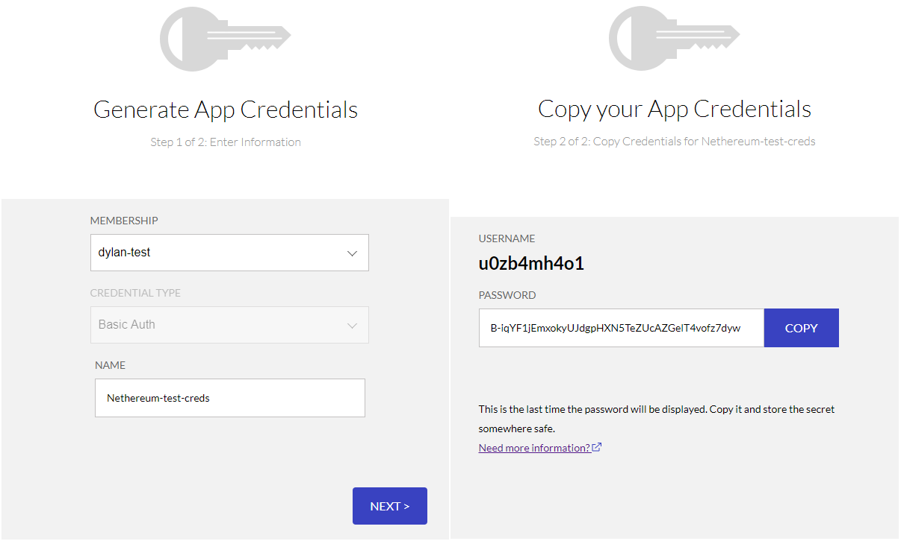
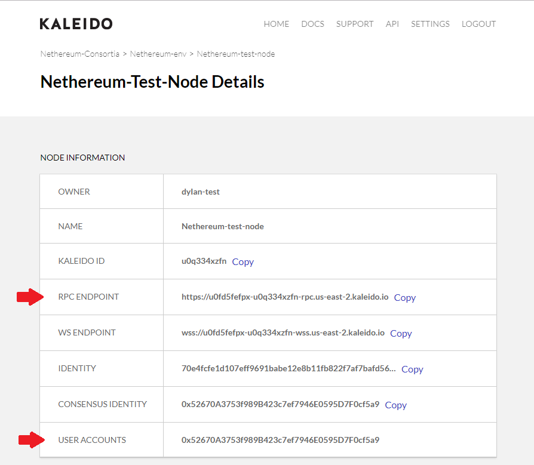
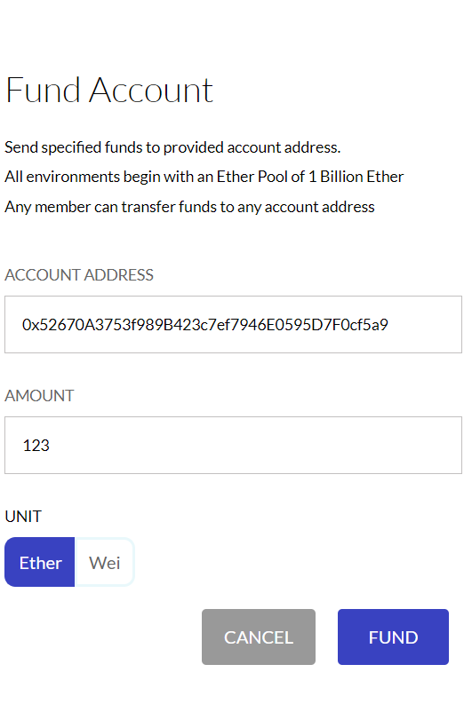
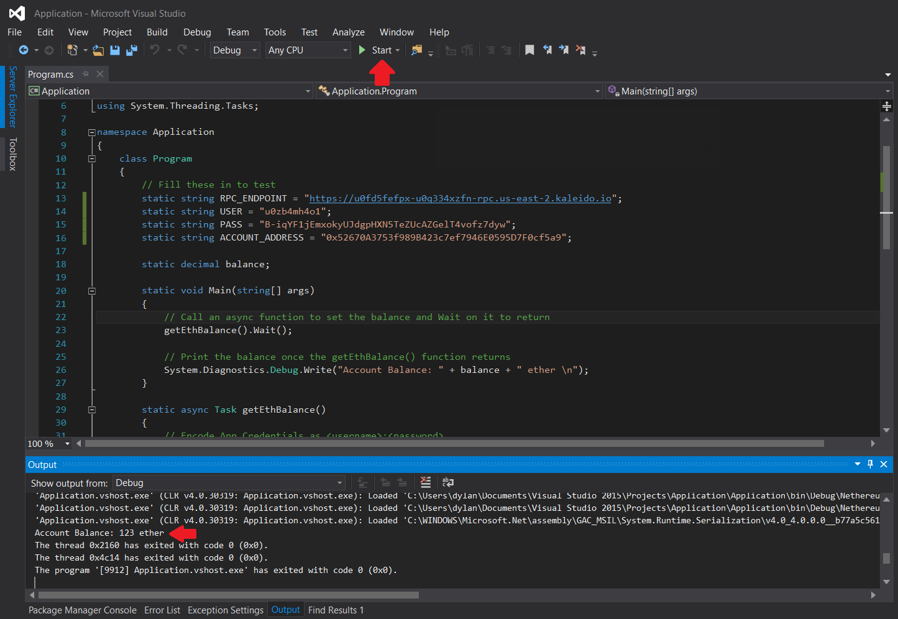

Recently, we've received questions about connecting to the Kaleido platform via <a href="https://nethereum.com/">Nethereum</a>, an open source .NET integration library for Ethereum. To test this, I've written a short application to connect to a Kaleido node and get the balance of an account. You can <a href="https://github.com/kaleido-io/kaleido-nethereum-example">check it out here</a>. Before we can run this, we need to set a few things up first.
<h2>Set up</h2>
Obviously, the most important thing we need when testing connection to a Kaleido node is a Kaleido node itself. If you don't already have one, you can follow the <a href="http://console.kaleido.io/docs/docs/createnet/">documentation here</a> on setting up a network. After you have an environment with at least one node, you will need to create app credentials in order to securely communicate with the node. To do so:
<ol>
 	<li style="list-style-type: none;">
<ol>
 	<li>Navigate to the environment containing the node you wish to target</li>
 	<li>Click the <b>Add</b> dropdown in the top right portion of the screen</li>
 	<li>Select <b>New App Credentials</b></li>
 	<li>Select the membership you wish to associate the credentials with</li>
 	<li>Supply a name for the credentials and click <b>Next</b></li>
 	<li>Be sure to save the credentials. The password is ephemeral and cannot be redisplayed</li>
</ol>
</li>
</ol>

Next we need to fund an account so that we can get a non-zero balance to ensure this actually works. Using the environment-specific Kaleido Ether Pool, you have the ability to send ether to any valid Ethereum address; however it's probably better that we send ether to an account we actually control. So let's grab a user account address for one of the nodes in our network. You can find this by clicking on a node to see the node details page. User accounts will have at least one address at the bottom of the list. We also need the RPC endpoint for a node with the same membership as the app credentials. Take note of this so we can use it later.

Now that we have an address, we can go to the Ether Pool, which is located at the bottom of the Environment page. Here we can input the account address we just copied and an ether amount. Click <strong>Fund</strong> and the account will get funded!

<h2>Test it out!</h2>
Now we want to clone the <a href="https://github.com/kaleido-io/kaleido-nethereum-example">GitHub repo</a> I mentioned earlier and open the <a href="https://github.com/kaleido-io/kaleido-nethereum-example/blob/master/Application/Program.cs">Program.cs file</a> under the Application directory. I'll be using Visual Studio 2015 to edit and run this application.

<code>static string RPC_ENDPOINT = "";
static string USER = "";
static string PASS = "";
static string ACCOUNT_ADDRESS = "";</code>

These are the the only fields you need to change in order to run the program. Here, you'll add the RPC endpoint of the node in quotes, the username of the application credentials, the password for the credentials, and the account address. Now, you can run the application and see the ether balance print out in the debug console.

To break this down, we have a main function that gets executed initially, calls the <code>getEthBalance</code> function that does most of the work, and then prints out the balance once the <code>getEthBalance</code> function is finished.

In the <code>getEthBalance</code> function, we need a Nethereum.Web3 object to talk to the node and pull info from it. To build this we need an implementation of an IClient object, so we'll use the RpcClient object since we have the RPC endpoint of our node. First though we need to encode our app credentials in the form "username:password", into a header value for RPC communication to our node.

<code>var byteArray = Encoding.ASCII.GetBytes(USER + ":" + PASS);
AuthenticationHeaderValue auth = new AuthenticationHeaderValue("Basic", Convert.ToBase64String(byteArray));</code>

Then, we can create an RpcClient object using our RPC endpoint and the auth object from above.

<code>IClient client = new RpcClient(new Uri(RPC_ENDPOINT), auth, null, null, null);
var web3 = new Web3(client);</code>

Now we can call the web3 function to get the balance of an account. We need to wait on the function call to return, so we use the <code>await</code> keyword here. The returned value is denoted in wei, but we want it in ether so we use another Web3 function to convert it for us.

<code>var some = await web3.Eth.GetBalance.SendRequestAsync(ACCOUNT_ADDRESS);
balance = Web3.Convert.FromWei(some.Value);</code>

And that's it! Now we have the balance for our address so we can print it out or use it however we want!